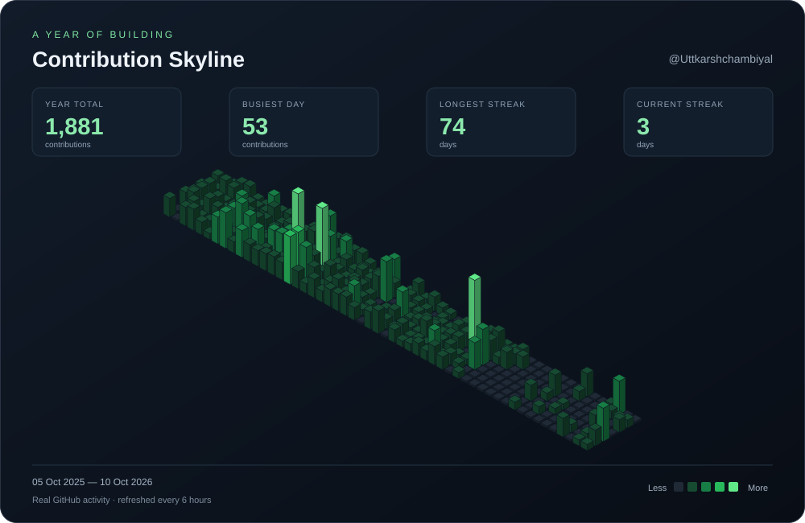

<!-- PERSONAL README HEADER -->

  

---

<!-- WHOAMI:START -->

<h3 align="center"></h3>

<picture>
  <source media="(max-width: 767px)" srcset="assets/whoami-card-mobile.svg" />
  
</picture>

About me — text version

**Uttkarsh Chambiyal** · B.Tech CSE, Semester 3 · Bengaluru, Karnataka, India.

- **Focus:** Frontend development, data structures & algorithms, competitive programming, and UI/UX design with Figma.
- **Currently learning:** React, Node.js, MongoDB, Spring Boot, and SwiftUI.
- **Also exploring:** System design fundamentals and AI/ML basics.
- **Tools:** Claude, Codex, IntelliJ IDEA, PyCharm, and DataGrip.
- **Hobbies:** Coding, video editing, Formula 1, and hackathons.
- **Open to:** Internships, hackathons, freelance projects, and open source.

Passionate about building interactive web experiences, bringing code and creativity together, and crafting smooth animations.

<!-- WHOAMI:END -->

---

<h3 align="center"></h3>

  

---

<h3 align="center"></h3>

&nbsp;

&nbsp;

  

<table>
  <tr>
    <td align="left">
      
    </td>
    <td align="right">
      
    </td>
  </tr>
</table>

---

<!-- CONTRIBUTION-SKYLINE:START -->

<h3 align="center"></h3>

  

<!-- CONTRIBUTION-SKYLINE:END -->
