<!-- PERSONAL README HEADER -->
<div align="center">
  
</div>

<!-- TYPING - ROLES -->
<div align="center">

[](https://git.io/typing-svg)

</div>

<br/>

<h3 align="center">
A Passionate Developer and Problem Solver
&nbsp;
&nbsp;
&nbsp;
</h3>

<br/>

---


### `> whoami`

```yaml
name      : Uttkarsh Chambiyal
role      : B.Tech CSE Student
location  : Bengaluru, Karnataka, India
degree    : B.Tech CSE  |  Semester 3

focus:
  - Frontend Development
  - Data Structures & Algorithms
  - Competitive Programming
  - UI/UX Design with Figma

currently_learning:
  - MERN Stack (Full-Stack)
  - System Design Fundamentals
  - AI/ML Basics

hobbies:
  - Coding
  - Video Editing
  - Formula 1
  - Hackathons

open_to:
  - Internships
  - Hackathons
  - Freelance Projects
  - Open Source
```

<br clear="right"/>

  ```diff
+ Passionate about building interactive web experiences
+ Exploring the intersection of code and creativity
+ Contributing to open-source projects
+ Crafting smooth CSS animations and web interactions
- Bugs are just features waiting to be discovered! 🐛
```

<div align="center">

[](https://www.linkedin.com/in/uttkarsh-chambiyal-3495a8380/)
[](https://www.uttkarshchambiyal.com/)
[](mailto:uttkarshchambiyal26@gmail.com)
[](https://twitter.com/uttkarshx26)


</div>

---

### `> tech --stack`

<div align="center">

**Languages**

[](https://skillicons.dev)

**Design & Tools**

[](https://skillicons.dev)

**Currently Learning**

[](https://skillicons.dev)

</div>

---

### `> cp --platforms`

<div align="center">

[](https://leetcode.com/Uttkarshchambiyal/)
&nbsp;
[](https://auth.geeksforgeeks.org/user/uttkarshchambiyal/)
&nbsp;
[](https://codeforces.com/)

</div>

<br/><br/>

<table>
  <tr>
    <td align="left">
      
    </td>
    <td align="right">
      
    </td>
  </tr>
</table>


---

<!-- CONTRIBUTION-SKYLINE:START -->
### `> contributions --skyline`

<div align="center">
  <a href="https://github.com/Uttkarshchambiyal?tab=overview">
    
  </a>
</div>
<!-- CONTRIBUTION-SKYLINE:END -->
